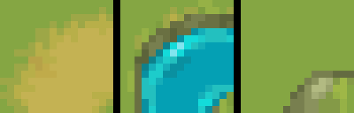
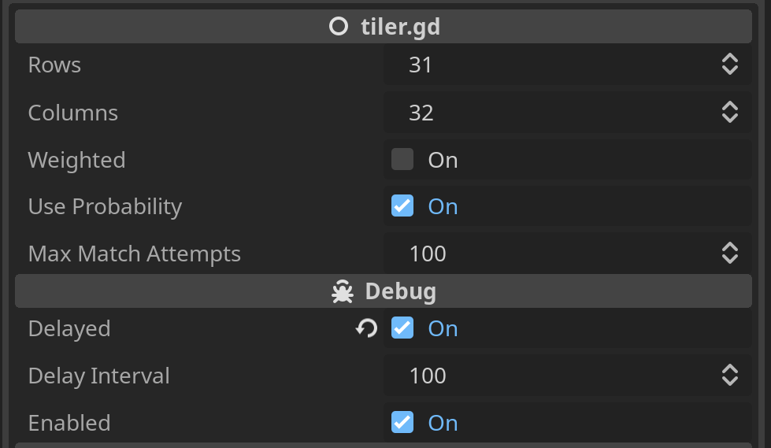
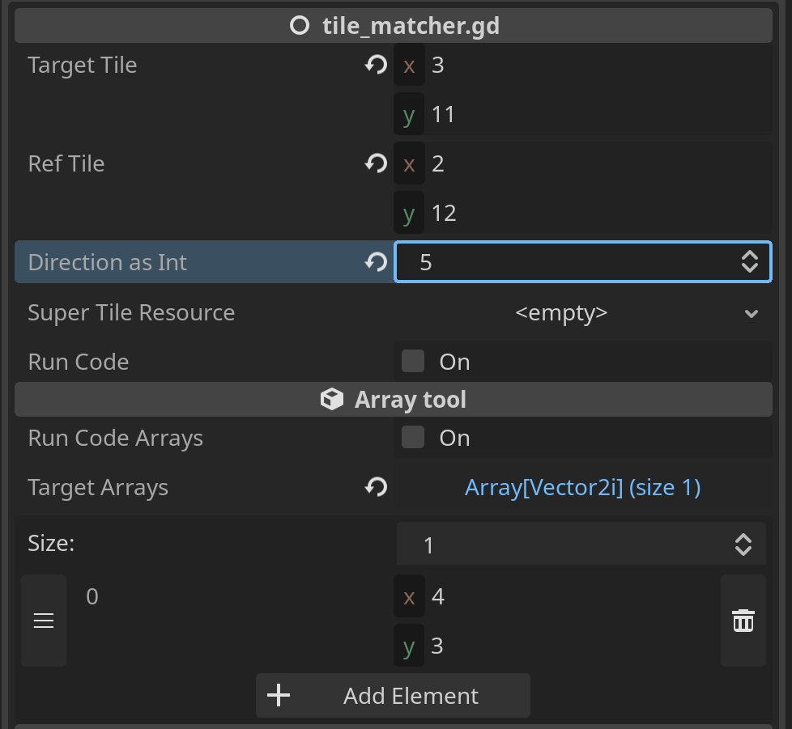

# Alt Auto-Tile for Godot 4

This is a very early WIP of an auto-tile system for Godot 4.
Last tested in Godot 4.1

This project assumes you have a basic knowledge of Godot's TileMap/TileSet system.
Every tile has a `SuperTileResource` in the `super_tile` custom data layer.
This currently holds which other tiles can surround it, and in which direction.
The current algorithm for tiling is primitive.
It basically just starts in the top left corner,
and tries to match the surrounding tiles as it moves column by column, row by row.
If stuck, it'll attempt to go back and try to match the previous tile.
If really stuck, it'll redo some of the row above and the current row.

---

## Notes:

* While it appears this might be a plugin,
turning the plugin on/off doesn't do anything at the moment.
* TileSet is CC0 by the artist [Shade](https://merchant-shade.itch.io/16x16-puny-world)

---

## Possible Improvements:

### Tile matching resources:

All of these 3 tiles can share the same left and top surrounding tiles.
Instead of setting it for each tile, like in the current system, 
it would be better to have a resource that can be shared between tiles.

---

## Current Limitations:

* Only works on one layer and atlas at the moment.

---

## Tiler Node:

### This node scans a reference tilemap, and tries to place the correct tile based on the surrounding tiles.

### How to use:

**Rows** and **Columns** are the number of rows and columns to tile.

**Weighted** is whether or not the tilemap should be weighted.

**Probability** use `SuperTileResource` probability to determine which tile to use.
 -Off is random

**Max Match Attempts** is the number of times the tilemap will try to match a tile before giving up.

**Delayed** is whether or not to show the tilemap as it is being generated.

**Delayed Interval** is the number of steps to wait before updating the tilemap.

**Enabled** enables/disables the tiler.

## Tile Assistant Node:

### This node helps map which tiles go next to each other

### How to use:

**Ref Tile** is the tile that will be used as a reference to determine which tiles go next to it.

**Direction as Int** is the direction you wish to copy to another tile.

| Int | Direction    |
|-----|--------------|
| 0   | Top Left     |
| 1   | Top          |
| 2   | Top Right    |
| 3   | Right        |
| 4   | Bottom Right |
| 5   | Bottom       |
| 6   | Bottom Left  |
| 7   | Left         |

**Super Tile Resource** can be filled in with a `SuperTileResource` that will be added to the Target Tile.

**Target Tile** is the tile that will be modified(By pressing `Run Code`).

**Target Arrays** is an array of atlas tile coords that the reference tile will be copied to(By pressing `Run Code Arrays`).

### Example:

In the picture above, by pressing the checkmark next to `Run Code` the `Target Tile` will be modified to add the `Ref Tile`bottom tiles to the `Target Tile` bottom tiles.
By pressing the checkmark next to `Run Code Arrays` all the `Target Arrays` tiles will be modified to add the `Ref Tile`bottom tiles to the `Target Arrays` bottom tiles.
